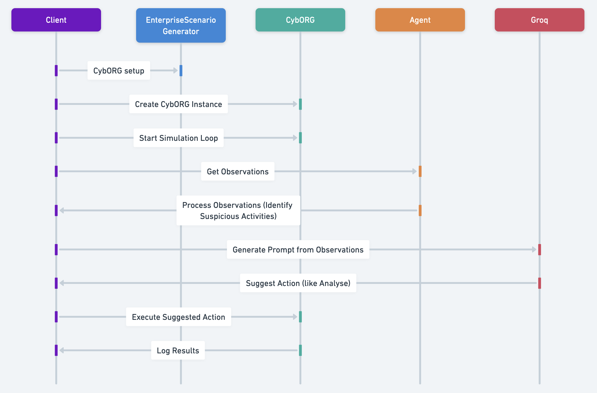

testing gpt / other llms on the cyborg environment

writeup: https://docs.google.com/document/d/1-2tfITqtReGDWNxjrSJ5jQocOZjX0y9aG255o7SKL5U/edit?usp=sharing

- results will probably be much better with rl agent guiding llm instead of only llm planning
- maybe try fine tuning on task specific stuff (on oss models for now, costly for openai models)
- ignore [securitybot.py](testing/securitybot.py), it was unfinished attempt at reimplementing the [depending on yourself when you should](https://arxiv.org/pdf/2403.17674.pdf) paper

**Probably good to use [DSPy](https://github.com/stanfordnlp/dspy), will be testing on the [dspy-test](https://github.com/nancyjlau/cyborg-gpt/tree/dspy-test) branch.**

## gpt-4-turbo-2024-04-09

$6.65 - observation 1 - 100 steps with only sleep action for blue agent cost  
$0.94 - observation 2 - 26 steps  
$1.87 - observation 5 - 48 steps   
$3.76 - observation 7 - 48 steps  
$0.83 - observation 11 - 100 steps  
$4.58 - 83 steps

[observations 1 - $6.65](observations/observations-1.txt)  
[observations 2 - $0.94](observations/observations-20240413175508.txt)  
[observation 5 - $1.87](observations/observations-20240413192821.txt)  
[observation 7 - $3.76](observations/observations-20240413221357.txt)  
[observation 11 - $0.83](observations/observations-20240413235343.txt)  

Total Spent:  
API requests: 1,210  
Tokens: 2,784,561  
Credits: $34.08  

help i have used around $40 now and i don't think i can have any more money for adding more gpt 4 credits.....

## llama 3 
observations with analyse and monitor actions successfully working
file: [llama3.py](llama3.py)

should probably add actual logging of results from [analyse actions](https://cage-challenge.github.io/cage-challenge-4/pages/tutorials/03_Actions/B_Blue_Actions/2_Analyse/) too so can take further actions from there, and maybe analyzing more than the first detected host?

currently using the groq api for llama3-8b-8192 because it's really fast and free.

You can get an api key here: https://console.groq.com/keys

## claude 3 opus - $5 free credit 
results later